# Báo cáo tấn công DDoS — Game server *The Isle: Evrima*

**Bên bị tấn công:** thuê bao FTTH VNPT (2 đường), game server The Isle Evrima 250 slot chạy trên host Windows tại chỗ.
**Phạm vi dữ liệu:** 13/09/2026 → 25/09/2026 10:47 (giờ VN, UTC+7).
**Nguồn dữ liệu:** log của WAF-Shield Enterprise v3.7.5 chạy trực tiếp trên host (WinDivert 2.2, bắt gói ở tầng kernel trước khi tới socket ứng dụng) — `shield.log` + `forensic.log` (snapshot mỗi 1 giây). Tổng **1,4 GB log thô** đã được bóc tách bằng script; mọi số liệu trong báo cáo sinh trực tiếp từ log, không phải ước lượng.
**Mục đích:** cung cấp cho đội scrubbing VNPT toàn bộ hồ sơ tấn công — thời điểm, vector, băng thông, pps, cổng đích, tập IP nguồn, và các đặc trưng dùng được làm signature lọc.

> ## 🔴 Cập nhật 02/10/2026 — tấn công SAU KHI AntiDDoS đã active
> Scrubbing đã ép bot nước ngoài xuống ≤ 4,7 Mbps/IP, nhưng **(1) lưu lượng từ IP trong nước không được lọc** (một IP Viettel phát 112,7 Mbps, hai đợt 220–250 Mbps về tận thuê bao) và **(2) bão IP giả mạo 7.000–11.700 IP/giây chỉ 10–30 Mbps** vẫn đi qua, làm server game sập 5 lần. **03/10 02:00** lặp lại: một thuê bao VNPT `125.235.229.146` phát 64 Mbps suốt 17 phút không bị cắt.
> **→ Xem báo cáo riêng: [bao-cao-2026-10-02.md](bao-cao-2026-10-02.md)** (kèm 4 file CSV `07`–`10` trong `du-lieu/`).

> **Dữ liệu chi tiết dạng bảng nằm trong [`du-lieu/`](du-lieu/)** — 6 file CSV mở được bằng Excel. Xem [Phụ lục A](#phụ-lục-a--các-file-dữ-liệu-kèm-theo).

---

## Mục lục

1. [Tóm tắt điều hành](#1-tóm-tắt-điều-hành)
2. [Đối tượng bị tấn công](#2-đối-tượng-bị-tấn-công)
3. [Lịch sử bị tấn công](#3-lịch-sử-bị-tấn-công)
4. [Các vector tấn công](#4-các-vector-tấn-công-đã-ghi-nhận)
5. [Nguồn tấn công (botnet)](#5-nguồn-tấn-công-botnet)
6. [Những gì phía khách đã làm và giới hạn](#6-những-gì-phía-khách-đã-làm-và-giới-hạn-của-nó)
7. [Đề nghị cụ thể với VNPT](#7-đề-nghị-cụ-thể-với-vnpt)
8. [Phụ lục A — file dữ liệu](#phụ-lục-a--các-file-dữ-liệu-kèm-theo) · [B — phương pháp](#phụ-lục-b--phương-pháp-và-độ-tin-cậy) · [C — khai báo cổng gửi VNPT](#phụ-lục-c--khai-báo-dịch-vụ-và-cổng-gửi-kèm-form-đăng-ký-antiddos)

---

## 1. Tóm tắt điều hành

| Chỉ số | Giá trị |
|---|---|
| Khoảng thời gian có log đầy đủ | 16/09 23:01 → 25/09 10:47 (có ghi nhận từ 13/09) |
| Số đợt tấn công đo được | **49 đợt** (chưa tính 21/09 — log forensic đã bị xoay mất, nhưng `shield.log` ghi 6 đợt) |
| Ngày bị nặng nhất | **23/09/2026 — 18 đợt trong 24 giờ** |
| Đỉnh băng thông | **451 Mbps** (23/09 01:45:40) |
| Đỉnh packet rate | **132.871 pps** (17/09 01:06:24 — gói 53 B, chỉ 57 Mbps) |
| Cổng đích bị tấn công | **UDP/7777 — 100% lưu lượng tấn công**, không cổng nào khác |
| Tổng gói WAF đã hủy | **90.234.214 gói** |
| Tổng lưu lượng tấn công | **≈100,9 GB** (≈807 Gbit) trong 4.955 giây bị tấn công |
| Số IP nguồn tấn công đã xác định | **7.161 IP** thuộc **6.548 subnet /24** khác nhau |
| Số IP WAF đã tự động chặn | **6.985 IP** (9.238 lệnh chặn) |
| Lưu lượng hợp lệ bình thường (~250 người chơi) | **≈4.650 pps / 3,6 Mbps** (p50) — xem §3.3 |

### Ba điều quan trọng nhất

**1. Toàn bộ tấn công đổ vào một cổng duy nhất: UDP/7777.**
Không có SYN flood, không có HTTP flood, không có cổng nào khác bị nhắm (xem §3.4). Một ACL/rate-limit đặt đúng trên UDP/7777 tới IP thuê bao xử lý được gần 100% khối lượng.

**2. Có vector chỉ 5–6 Mbps khi tới host nhưng vẫn làm sập dịch vụ.**
Trong hai đợt DNS reflection (§4.3), lưu lượng người chơi hợp lệ sụp từ **5.000 pps xuống 1.450 pps trong 15 giây** trong khi đường truyền còn trống hoàn toàn và WAF hủy 100% gói tấn công. **Gói của người chơi bị mất ở phía thượng nguồn, không phải ở last-mile của khách.** Đây là vector mà thiết bị phía khách không thể can thiệp, và cũng là vector mà scrubbing đo theo **bps** sẽ không nhìn thấy.

**3. Từ 23/09 tấn công chuyển sang dạng nhịp ngắn, rất đều: mỗi đợt 16–18 giây, ~188 Mbps, 1–2 đợt mỗi giờ, suốt ngày đêm.**
Kiểu này qua được mọi cơ chế phản ứng thủ công và cả cơ chế tự động xoay IP PPPoE (mất 30–90 giây mới hoàn tất). Cần **lọc thường trực**, không phải lọc theo sự cố.

---

## 2. Đối tượng bị tấn công

### 2.1 Sơ đồ hạ tầng và vị trí đề nghị đặt scrubbing

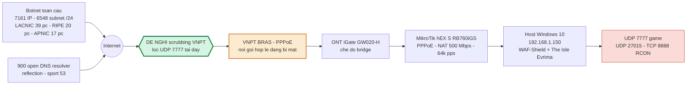

### 2.2 Thông tin thuê bao / đích tấn công

| Hạng mục | Giá trị |
|---|---|
| Đường truyền bị tấn công | Cáp quang VNPT #1 → ONT iGate GW020-H (bridge) → MikroTik hEX S quay PPPoE |
| Dải IP được bảo vệ (VNPT cấp 25/09/2026) | **`14.253.193.8/29`** — 8 địa chỉ, dùng được `14.253.193.9`–`14.253.193.14`. Xem [Phụ lục C.1](#c1-dải-ip-được-bảo-vệ) |
| Trước khi có IP tĩnh | IP public **động**, đã xoay rất nhiều lần (xem ghi chú bên dưới) |
| Trần thực đo | Nhận tới **451 Mbps**; rất nhiều đợt bị chặn đúng ở **185–190 Mbps** (nghi trần hướng quốc tế) |
| Năng lực router khách | MikroTik hEX S (MT7621): NAT ~500 Mbps, **~64.000 pps** với gói nhỏ |
| Cổng dịch vụ mở ra Internet | UDP **7777** (game), UDP 27015, 64738, 15000, 10000; TCP 7777–7779, **8888** (RCON), 10000, 15000, 64738 |
| Cổng bị tấn công | **chỉ UDP/7777** |
| Các IP public đã bị nhắm (PPPoE động, đã xoay nhiều lần) | `222.254.143.44`, `113.179.185.108`, `14.165.211.78`, `113.184.246.53`, `123.19.93.21`, `14.245.78.243`, `14.245.79.59` |
| Đường truyền #2 (chỉ dùng remote, **chưa bị tấn công**) | Cáp quang VNPT #2, ONT iGate GW040-NS / AX3000, IP public riêng |

> **Lưu ý về IP:** khách đã tự động hóa việc xoay IP PPPoE khi bị tấn công (§6). Vì vậy mỗi đợt thường nhắm một IP khác. **Đo được ngày 23/09: kẻ tấn công tìm lại IP mới trong 8–17 phút** — gần như chắc chắn có công cụ tự động tra IP server qua danh sách server trong game của The Isle. Xoay IP vì thế không còn là biện pháp hiệu quả.

---

## 3. Lịch sử bị tấn công

### 3.1 Bảng theo ngày

| Ngày | Số đợt | Tổng thời gian bị đánh | Đỉnh Mbps | Đỉnh pps | IP nguồn bị chặn | Gói bị hủy | Ghi chú |
|---|---|---|---|---|---|---|---|
| 13/09 | ≥1 | — | **~242** | — | 22 | — | Đợt đầu khách ghi nhận; đường truyền bão hòa hoàn toàn |
| 14/09 | 4 | ~30 phút | **242** | ~170.000 | ~270 | — | 4 đợt UNDER_SIEGE (09:52, 10:15, 12:32) |
| 15/09 | 5 | — | — | — | 238 | — | Log forensic đã bị xoay mất |
| 16/09 | 1 | ~3,5 phút | **185** | 19.700 | — | — | 03:15:14–03:18:49, WAF hủy 98,8% |
| **17/09** | **5** | **1.479 s (24,6 ph)** | 180 | **132.871** | 411 | 6.453.933 | **3 vector khác nhau trong một ngày** (§4) |
| 18/09 | 0 | — | — | — | 0 | 0 | Ngày yên |
| **19/09** | **4** | **1.376 s (22,9 ph)** | **332** | 45.523 | 464 | 31.910.253 | Đợt 02:30 kéo 14,5 phút |
| 20/09 | ? | — | — | — | — | — | **Không có log** (trống 19/09 23:32 → 21/09 12:46) |
| 21/09 | 6 | — | 417 | ~44.000 | 927 | — | forensic đã xoay mất; `shield.log` ghi 6 đợt |
| **22/09** | **10** | **345 s** | 256 | 27.440 | 1.406 | 7.716.644 | Bắt đầu kiểu nhịp ngắn |
| **23/09** | **18** | **1.393 s (23,2 ph)** | **451** ← đỉnh | 47.955 | **2.962** | 31.272.779 | **Ngày nặng nhất** |
| **24/09** | **10** | **302 s** | 218 | 24.304 | 980 | 5.786.921 | Đợt 16–18 giây rất đều |
| 25/09 (tới 10:47) | 2 | 366 s | 189 | 20.130 | 221 | 7.092.572 | **Vẫn đang tiếp diễn** |

*13–16/09 lấy từ hồ sơ vận hành và ảnh chụp màn hình; từ 16/09 23:01 trở đi là số liệu bóc trực tiếp từ log.*

### 3.2 Biểu đồ

**Số đợt tấn công mỗi ngày**

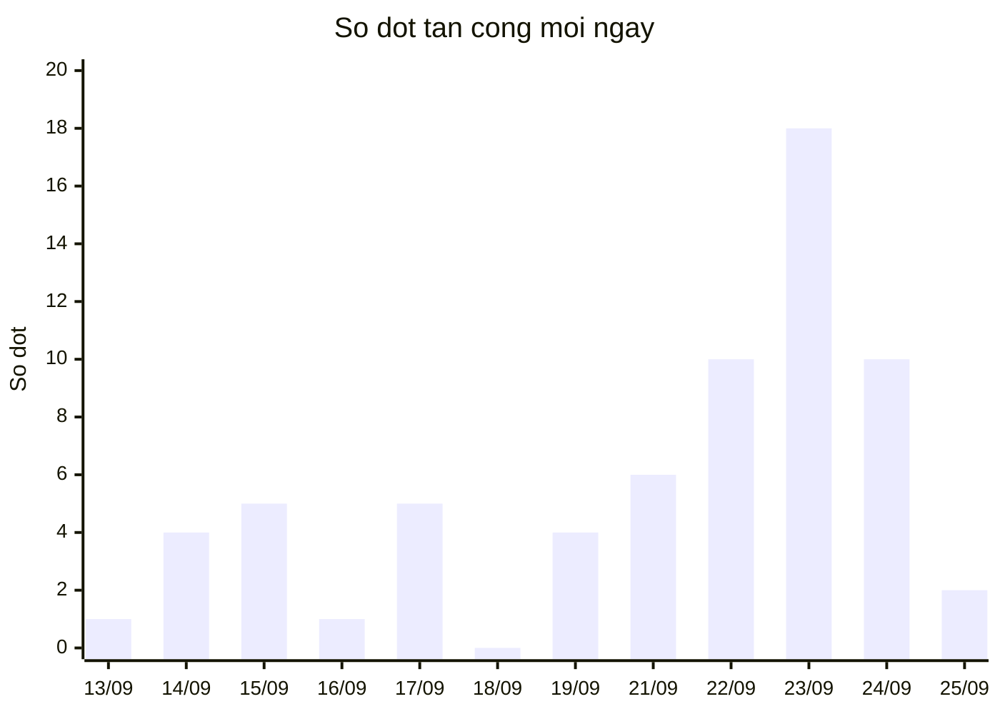

**Đỉnh băng thông mỗi ngày (Mbps)**

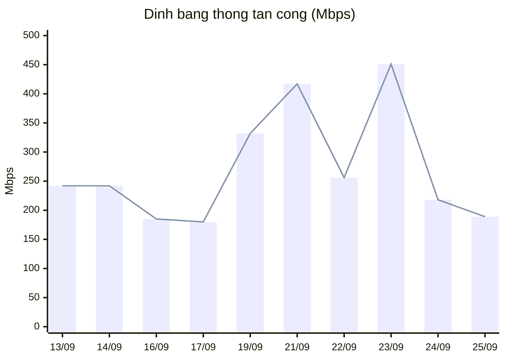

**Phân bố theo giờ trong ngày** (giờ bắt đầu của 49 đợt, giờ VN)

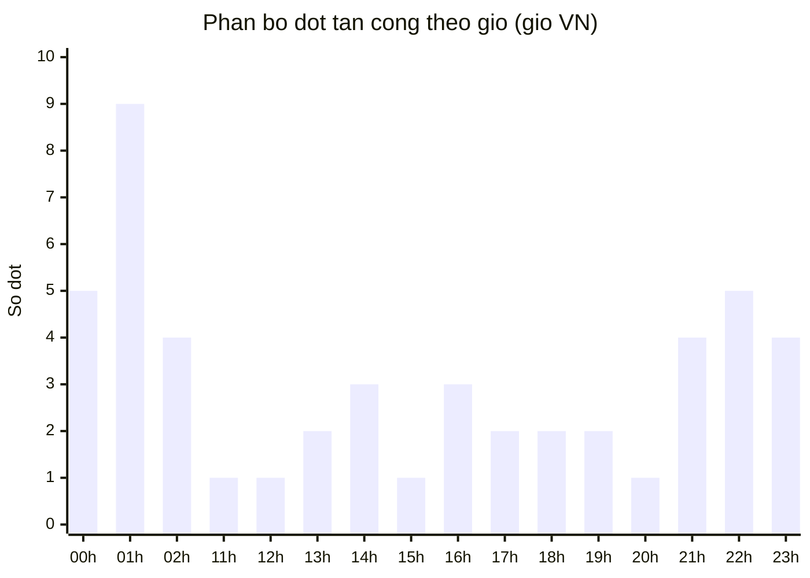

Tấn công tập trung **00h–02h** (18 đợt) và **21h–23h** (13 đợt) — đúng giờ đông người chơi nhất và giờ khách ngủ. Từ 23/09 đã rải đều cả ngày.

**Hình dạng một đợt điển hình** — đợt đỉnh 451 Mbps, 23/09 01:45 (Mbps theo từng giây):

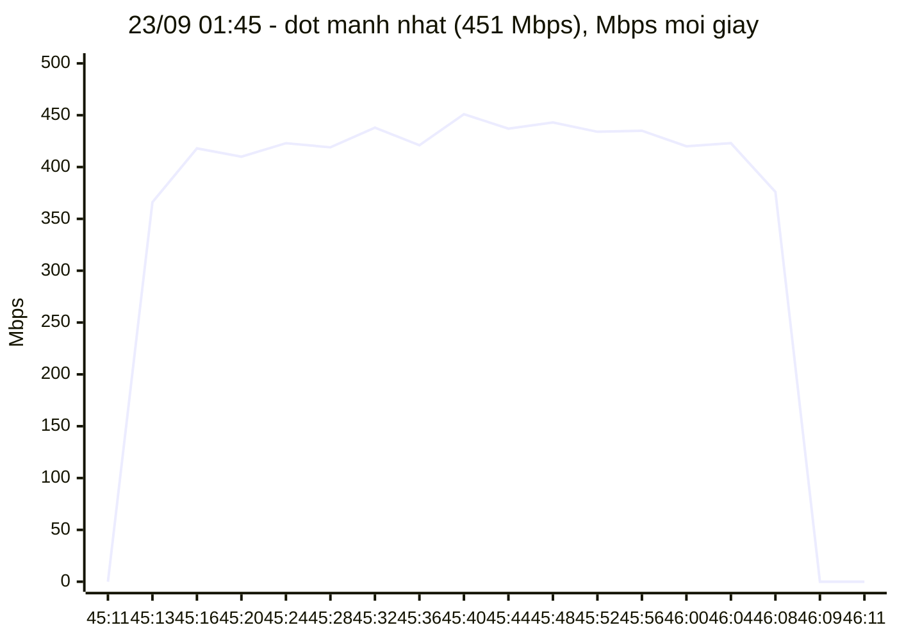

Lưu lượng **lên trần trong 2 giây, giữ phẳng lì 56 giây, rồi tắt đột ngột**. Không có giai đoạn tăng dần — đặc trưng của dịch vụ booter thuê theo lượt.

**Kiểu tấn công hiện tại (từ 23/09)** — đợt 25/09 01:22, dài 18 giây:

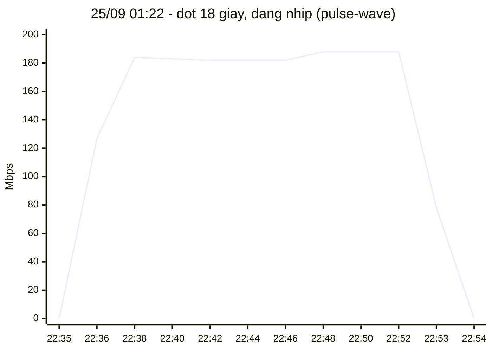

### 3.3 Lưu lượng hợp lệ để đối chiếu (rất quan trọng khi đặt ngưỡng lọc)

Đo trên **121.007 giây** ở trạng thái bình thường, server ~250 người chơi:

| Phân vị | pps | Mbps |
|---|---|---|
| p50 | 4.649 | 3,63 |
| p90 | 5.360 | 4,31 |
| p99 | 5.916 | 3,72 |
| Đỉnh quan sát được | 8.103 | ~41 |

Từng luồng người chơi thật: **29 pps / 2,4 KB/s** (p50), **96 pps / 9,8 KB/s** (p99,9).
Một bot trong đợt flood: **507 pps trung bình, đỉnh 6.349 pps**, gói **~1.180 B**.

#### Phân bố kích thước gói của lưu lượng game **hợp lệ** trên UDP/7777

Đo trên **7.934 giây "sạch"** (chỉ giữ các giây: 0 gói bị hủy, 100% đã xác thực hai chiều, ≤20 IP chưa xác thực, và UDP/7777 chiếm ≥98% lưu lượng) — tổng **38.205.760 gói hợp lệ**:

| Kích thước gói | Số gói | Tỉ lệ | Tỉ lệ tích lũy |
|---|---|---|---|
| ≤ 64 B | 22.799.419 | 59,68% | 59,68% |
| 65 – 128 B | 13.997.925 | 36,64% | **96,31%** |
| 129 – 256 B | 1.174.941 | 3,08% | **99,39%** |
| 257 – 512 B | 48.389 | 0,13% | **99,51%** |
| 513 – 1024 B | 156.523 | 0,41% | 99,92% |
| 1025 – 1400 B | 2.923 | 0,01% | 99,93% |
| 1401 – 1500 B | 25.640 | 0,07% | 100% |

> ⚠️ **Điểm này rất quan trọng và phải nói rõ:** game **CÓ** dùng gói lớn hợp lệ — 0,49% gói hợp lệ nằm trong khoảng 513–1500 B. **Vì vậy KHÔNG được hủy thẳng gói lớn trên UDP/7777**, sẽ làm người chơi không vào được server.
>
> **Nhưng tốc độ thì tách biệt hoàn toàn:**
>
> | | Gói > 512 B trên UDP/7777 |
> |---|---|
> | Lưu lượng hợp lệ — trung bình | **23,3 pps** |
> | Lưu lượng hợp lệ — **đỉnh cao nhất đo được** | **123 pps** (23/09 23:19:35) |
> | Trong đợt tấn công vector A | **~20.000 pps** |
> | **Hệ số tách biệt** | **≈160 lần** |
>
> Đây là cơ sở cho luật lọc ở §7 — **rate-limit gói lớn**, không phải hủy gói lớn.

⚠️ **Không đặt ngưỡng cho lưu lượng chung tới thuê bao dưới ~6.000 pps / ~45 Mbps:** host tự tải file (Steam / Windows Update qua QUIC, cổng nguồn 443) có lúc đạt **413 Mbps / 44.758 pps hoàn toàn hợp lệ** (ghi nhận 23/09 14:19, 0 gói bị hủy). Mọi ngưỡng nên áp **riêng cho UDP/7777**, nơi lưu lượng hợp lệ chưa bao giờ vượt ~5 Mbps.

### 3.4 Cổng đích — bằng chứng chỉ có UDP/7777 bị tấn công

Tổng hợp toàn bộ chu kỳ (file [`du-lieu/06-cong-dich-theo-ngay.csv`](du-lieu/06-cong-dich-theo-ngay.csv) có đủ 14.021 dòng):

| Cổng đích | Tổng gói quan sát | Gói bị hủy | Nhận xét |
|---|---|---|---|
| **UDP/7777** | 887.693.298 | **90.226.637** | Cổng game — **toàn bộ tấn công ở đây** |
| TCP/8888 | 3.950.915 | 0 | RCON của panel quản trị — lưu lượng hợp lệ |
| TCP/10000 | 331.797 | 683 | Queue — hợp lệ |
| Các cổng tạm 49152–65535 | ~15 triệu | 0 | Kết nối do host tự mở (tải file, HTTPS) — hợp lệ |

Gói bị hủy trên UDP/7777 theo ngày: 17/09 `6.453.272` · 19/09 `31.907.653` · 22/09 `7.714.946` · 23/09 `31.271.961` · 24/09 `5.786.375` · 25/09 `7.092.426`.
**Mọi cổng khác: 0 gói bị hủy vì tấn công.**

---

## 4. Các vector tấn công đã ghi nhận

Có **4 vector khác nhau**, tất cả nhắm UDP/7777.

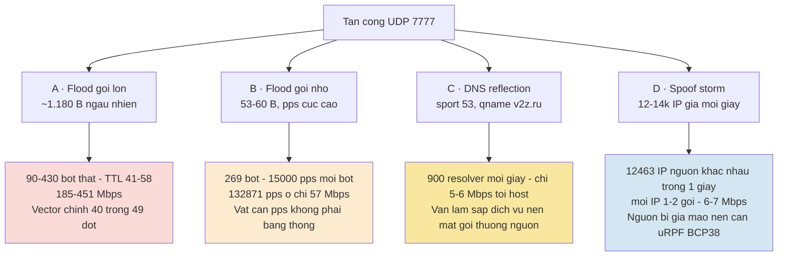

### 4.1 Vector A — UDP flood gói lớn (vector chính, 40/49 đợt)

Trích snapshot thật (25/09 01:22:45):

```
==== [2026-09-25 01:22:45] FORENSIC SNAPSHOT mode=WAR window=1.0s ====
TOTAL pps=19804 mbps=182.30 pkts=19822 drops=19292 (97%) verified=3%
      tcp=7 udp=19815 icmp=0 syn=0 frag=0 uniq_ip=109 uniq_net=108
DROP_REASONS: L0_BLACKLIST=19283 UDP_ENTROPY=9
SIZE_HIST: <=64=292 <=128=203 <=256=20 <=512=4 <=1024=3679 <=1400=14545 <=1500=1079
TTL_HIST:  <=48=3550 <=64=15585 <=128=438 >240=249
TOP_DST_PORTS: 7777[pkts=19815 mbps=182.29 avg=1150B verified=3% dropped=19292]
TOP_SRC_IPS (267 distinct):
  45.70.165.60    pkts=645 mbps=6.10 avg=1182B ttl=51 sport=30892 dport=7777
  189.34.154.37   pkts=553 mbps=5.21 avg=1178B ttl=50 sport=14633 dport=7777
  81.228.52.89    pkts=551 mbps=5.13 avg=1164B ttl=48 sport=41853 dport=7777
  161.142.142.135 pkts=545 mbps=5.13 avg=1176B ttl=54 sport=15288 dport=7777
  176.186.95.168  pkts=535 mbps=5.05 avg=1179B ttl=50 sport=49667 dport=7777
```

| Đặc trưng | Giá trị (dùng làm signature) |
|---|---|
| Giao thức / cổng đích | UDP → **7777** |
| Kích thước gói | **1.024–1.500 B, trung bình ~1.180 B** (người chơi thật: 60–113 B) |
| Nội dung payload | **Bytes ngẫu nhiên hoàn toàn**, entropy Shannon 7,0–7,3; không có cấu trúc giao thức game |
| Cổng nguồn | Ngẫu nhiên cao (2.000–65.000), **cố định cho mỗi bot trong suốt đợt** |
| TTL quan sát | 41–58 (đa số) → TTL gốc 64 ⇒ thiết bị Linux / IoT / router |
| Số IP nguồn mỗi đợt | 86–430 IP (điển hình 90–130) |
| pps mỗi bot | 380–790 pps (trung bình 507) |
| Nguồn có bị giả mạo? | **Không** — TTL nhất quán cho từng IP, cổng nguồn bền, phân bố TTL hợp lý ⇒ host thật |

### 4.2 Vector B — UDP flood gói nhỏ, packet-rate cực cao

Trích snapshot thật (17/09 01:06:24 — **đỉnh pps của toàn chiến dịch**):

```
==== [2026-09-17 01:06:24] FORENSIC SNAPSHOT mode=UNDER_SIEGE window=1.0s ====
TOTAL pps=132871 mbps=57.35 drops=123789 (93%)
SIZE_HIST: <=64=116346 <=128=16476 <=256=52
TTL_HIST:  <=32=126 <=48=75473 <=64=55261 <=128=1969 >240=73
TOP_DST_PORTS: 7777[pkts=132836 mbps=57.22 avg=53B dropped=123789]
TOP_SRC_IPS (269 distinct):
  192.141.112.184 pkts=15202 pps=15199 avg=53B ttl=42 sport=55563 dport=7777
  95.139.44.152   pkts=14880 pps=14877 avg=53B ttl=43 sport=8227  dport=7777
```

| Đặc trưng | Giá trị |
|---|---|
| Kích thước gói | **53 B** (payload UDP 25 B) |
| pps | **132.871 pps ở chỉ 57 Mbps** |
| pps mỗi bot | **tới 15.200 pps** từ một IP duy nhất |
| Số IP nguồn | 269 |
| Tác động | **Vượt trần packet-rate của router khách (~64.000 pps)** trong khi băng thông còn trống |

> ⚠️ **Vector này vô hình với scrubbing đo theo bps.** 57 Mbps là mức bình thường, nhưng 132.871 pps làm nghẽn thiết bị. **Ngưỡng lọc phải tính cả pps.**

### 4.3 Vector C — DNS reflection / amplification (**nguy hiểm nhất**)

Trích snapshot thật (17/09 00:22:10):

```
==== [2026-09-17 00:22:10] FORENSIC SNAPSHOT mode=WAR window=1.0s ====
TOTAL pps=2086 mbps=5.39 drops=1556 (74%) uniq_ip=709 uniq_net=559
DROP_REASONS: WAR_REFLECTION=1556
TOP_SRC_PORTS (224 distinct): 53=1557 ...
TOP_SRC_IPS (930 distinct):
  8.8.8.8         pkts=48 avg=52B ttl=123 sport=53 dport=7777
                  payload=0038838000010000000000000376327a0272750000010001
  1.1.1.1         pkts=9  avg=52B ttl=57  sport=53 dport=7777
  46.254.212.130  pkts=9  avg=52B ttl=55  sport=53 dport=7777
  217.65.3.80     pkts=9  avg=52B ttl=54  sport=53 dport=7777
  152.200.241.157 pkts=9  avg=68B ttl=45  sport=53 dport=7777
  195.214.211.96  pkts=8  avg=52B ttl=43  sport=53 dport=7777
  181.94.245.239  pkts=8  avg=52B ttl=39  sport=53 dport=7777
```

Giải mã payload: `03 76 32 7a | 02 72 75 | 00 | 0001 0001` = **`v2z.ru`, QTYPE=A**; cờ DNS `0x8380 / 0x8180 / 0x8105` xác nhận đây là **phản hồi** DNS, không phải truy vấn.

**Cơ chế:**

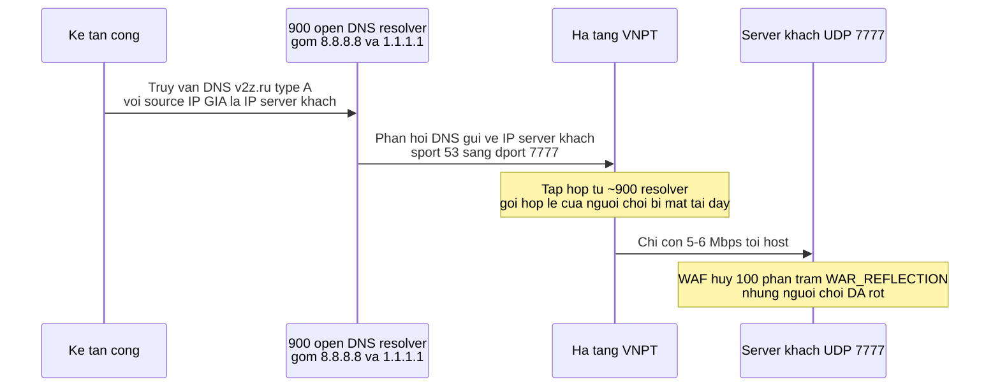

**Bằng chứng mất gói ở thượng nguồn** — pps hợp lệ trước/trong đợt reflection 17/09, đường truyền còn trống hoàn toàn:

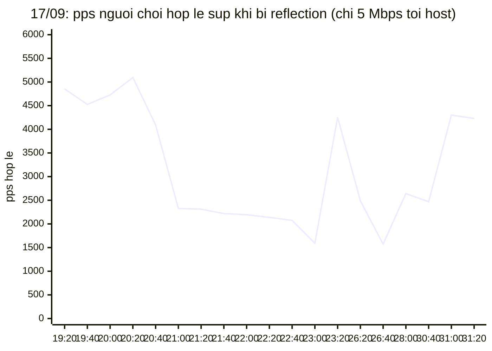

| Mốc (17/09) | pps hợp lệ | Mbps tới host |
|---|---|---|
| 00:19:20 → 00:20:20 (bình thường) | 4.526 – 5.095 | 3,1 – 4,5 |
| **00:20:40 — reflection bắt đầu** | 4.093 | 13,2 |
| **00:21:00 — sau 20 giây** | **2.327** (↓54%) | 5,2 |
| **00:23:20** | **1.592** (↓69%) | 5,4 |
| 00:31:00 — sau khi đợt kết thúc | 4.301 (hồi phục) | 2,6 |

Đợt thứ hai cùng dạng, **19/09 20:24:41 → 20:27:19**: pps hợp lệ **4.842 → 1.385** trong 20 giây; băng thông tới host **chỉ 5,1–5,5 Mbps**; 241.274 gói reflection bị hủy. Sau đợt này dịch vụ mất 22 phút mới trở lại.

> 🔴 **Kết luận bắt buộc nêu rõ:** trong cả hai đợt, host chỉ nhận **5–6 Mbps** trên đường 300+ Mbps, WAF hủy **100%** gói tấn công, **nhưng 54–69% gói của người chơi thật không bao giờ tới được host**. Không thiết bị nào phía khách gây ra điều này. **Tổn thất xảy ra trong mạng VNPT** — nghi ngờ policing/rate-limit theo pps hoặc theo số luồng ở BRAS, hoặc nghẽn hướng đi khi số luồng tăng vọt (mỗi giây có 700–900 IP nguồn mới). Đây là vector cần VNPT xử lý nhất.

### 4.4 Vector D — Spoof storm (địa chỉ nguồn bị giả mạo)

Trích snapshot thật (17/09 18:50:02):

```
==== [2026-09-17 18:50:02] FORENSIC SNAPSHOT mode=WAR window=1.0s ====
TOTAL pps=12515 mbps=6.13 drops=0 (0%) verified=0%
      udp=12503 uniq_ip=11322 uniq_net=8768
SIZE_HIST: <=64=6846 <=128=5666 <=256=3
TTL_HIST:  <=32=3056 <=48=3047 <=64=14 <=128=3188 <=240=3210
TOP_SRC_PORTS (10430 distinct)
TOP_SRC_IPS (12463 distinct, showing 20):
  87.151.89.18   pkts=2 avg=52B ttl=107 sport=35432 dport=7777
  162.29.121.189 pkts=2 avg=86B ttl=11  sport=57030 dport=7777
  9.65.236.127   pkts=2 avg=85B ttl=43  sport=37677 dport=7777
  48.68.163.95   pkts=2 avg=83B ttl=234 sport=56380 dport=7777
  100.178.40.48  pkts=2 avg=80B ttl=107 sport=46423 dport=7777
  56.244.126.65  pkts=2 avg=60B ttl=233 sport=38275 dport=7777
  111.222.122.124 pkts=2 avg=51B ttl=234 sport=43735 dport=7777
```

| Đặc trưng | Giá trị |
|---|---|
| Thời gian | 17/09 18:49:52 → 18:53:34 (3 phút 42 giây) |
| Số IP nguồn **khác nhau mỗi giây** | **12.463**, mỗi IP chỉ 1–2 gói |
| Băng thông | chỉ **6–7 Mbps**, 13–15k pps |
| TTL | Chỉ 4 nhóm rời rạc (43 / 107 / 233 / 234) trên hàng chục nghìn IP ⇒ **dấu hiệu giả mạo rõ ràng** |
| Nguồn không thể hợp lệ xuất hiện | `100.178.40.48` (dải **100.64/10 CGNAT**), `9.65.236.127`, `48.68.163.95`, `56.244.126.65`, `169.224.x.x` |
| Kết quả | **Game server chết** — log Unreal Engine tràn `FNetPacketNotify::Reset SequenceHistory`, người chơi bị `Left The Server while not being saved`, phải restart dịch vụ |

> 🔴 **Vector này chứng minh có gói với địa chỉ nguồn giả mạo đi qua mạng VNPT tới thuê bao.** Đề nghị VNPT bật **uRPF / BCP38 (anti-spoofing)** ở biên, và tối thiểu chặn các dải không thể là nguồn Internet hợp lệ (bogon, `100.64/10`, dải chưa cấp phát như `169.224/16`).

---

## 5. Nguồn tấn công (botnet)

### 5.1 Quy mô và độ phân tán

| Chỉ số | Giá trị |
|---|---|
| Tổng IP nguồn tấn công đã xác định | **7.161** |
| Trong đó bot tốc độ cao (≥150 pps) nhận diện được | **2.166** (trung bình 507 pps/bot, đỉnh 6.349 pps/bot) |
| Số IP WAF đã tự động chặn | **6.985** — 9.238 lệnh chặn: 7.694 lần 1 phút, 1.429 lần 5 phút, 115 lần 1 giờ (ban leo thang) |
| Số subnet **/24** khác nhau | **6.548** |
| Số subnet **/16** khác nhau | **3.144** |
| /24 tập trung nhất | `152.200.241.0/24` — chỉ **8 IP** |
| IP bị chặn lặp lại | 5.035 IP bị chặn 1 lần; 1.674 IP · 2 lần; 255 IP · 3 lần; 21 IP · 4–5 lần |

> **Không có cụm nào đáng kể.** 6.548 subnet /24 cho 7.161 IP nghĩa là gần như mỗi IP một /24 riêng. **Lọc theo danh sách prefix là bất khả thi** — phải lọc theo **hành vi trên cổng đích**. Danh sách IP đầy đủ vẫn được cung cấp (Phụ lục A) để VNPT đối soát ASN / liên hệ nhà mạng nguồn.

### 5.2 Phân bố theo khu vực đăng ký (RIR)

Toàn bộ 7.161 IP nguồn:

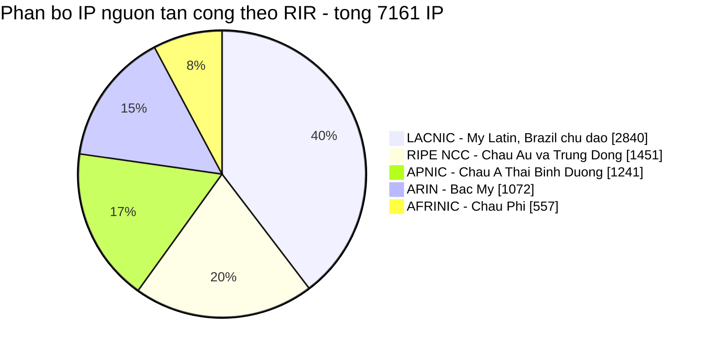

Riêng **2.166 bot tốc độ cao** (nguồn thật, vector A và B):

| RIR | Số bot | Tỉ lệ |
|---|---|---|
| **LACNIC** (Mỹ Latin) | **923** | **42,6%** |
| RIPE NCC | 546 | 25,2% |
| ARIN | 311 | 14,4% |
| APNIC | 279 | 12,9% |
| AFRINIC | 107 | 4,9% |

**Top /8 của bot tốc độ cao:**

| Tiền tố | Số bot | Khu vực |
|---|---|---|
| `177.0.0.0/8` | 142 | LACNIC — **chủ yếu Brazil** |
| `45.0.0.0/8` | 121 | Hỗn hợp; các khối `45.4–45.7`, `45.160–45.191`, `45.224–45.255` thuộc LACNIC (**Brazil**) |
| `103.0.0.0/8` | 107 | APNIC |
| `187.0.0.0/8` | 103 | LACNIC — **Brazil / Mexico** |
| `189.0.0.0/8` | 84 | LACNIC — **Brazil / Mexico** |
| `179.0.0.0/8` | 77 | LACNIC — **Brazil / Chile** |
| `190.0.0.0/8` | 64 | LACNIC |
| `186.0.0.0/8` | 63 | LACNIC — **Brazil / Argentina** |
| `37.0.0.0/8` | 56 | RIPE |
| `170.0.0.0/8` | 53 | `170.76+` thuộc LACNIC (**Brazil**) |
| `38.0.0.0/8` | 50 | ARIN (Cogent) |
| `201.0.0.0/8` | 50 | LACNIC — **Brazil** |

**Về phần "IP Brazil":** khối lớn nhất của botnet nằm trong các dải do **LACNIC / NIC.br (Brazil)** quản lý — `177/8`, `179/8`, `186/8`, `187/8`, `189/8`, `191/8`, `200/8`, `201/8`, cùng các khối `45.x`, `138.x`, `170.x`. Cộng lại **≈42,6% số bot tốc độ cao**. Đặc trưng **TTL 41–58** (TTL gốc 64) cho thấy đây là **thiết bị Linux / IoT / router dân dụng bị chiếm quyền**, không phải máy chủ thuê — đúng đặc điểm botnet router Brazil (họ Mirai / Bashlite).

> ⚠️ **Về độ chính xác:** cột `rir_uoc_luong` trong file CSV là ước lượng **cấp khu vực** dựa trên bảng phân bổ `/8` của IANA (tra được, ổn định), **không phải geolocation từng IP**. VNPT nên tra ASN chính xác từ danh sách IP kèm theo nếu cần gửi thông báo abuse tới nhà mạng nguồn.

### 5.3 Top 15 IP nguồn theo khối lượng gói quan sát được

| IP | RIR | Gói quan sát | Gói bị hủy | pps TB | TTL | Lần đầu | Lần cuối |
|---|---|---|---|---|---|---|---|
| `81.220.112.126` | RIPE | 1.029.509 | 1.028.346 | 1.181 | 51 | 19/09 02:30:43 | 19/09 02:45:16 |
| `38.210.126.18` | ARIN | 959.191 | 958.652 | 1.097 | 48 | 19/09 02:30:43 | 19/09 02:45:16 |
| `101.109.33.0` | APNIC | 659.597 | 659.214 | 755 | 51 | 19/09 02:30:43 | 19/09 02:45:16 |
| `45.166.30.72` | LACNIC | 632.950 | 632.633 | 836 | 44 | 19/09 02:30:43 | 19/09 02:45:15 |
| `45.179.70.87` | LACNIC | 630.454 | 630.454 | 835 | 51 | 19/09 02:30:54 | 19/09 02:45:16 |
| `186.26.105.11` | LACNIC | 583.877 | 583.562 | 702 | 43 | 19/09 02:30:43 | 19/09 02:45:16 |
| `109.220.152.97` | RIPE | 554.960 | 554.075 | 748 | 45 | 19/09 02:30:43 | 19/09 02:45:06 |
| `45.190.115.191` | LACNIC | 473.330 | 473.000 | 589 | 48 | 19/09 02:30:43 | 19/09 02:45:16 |
| `179.94.161.148` | LACNIC | 446.607 | 446.607 | 697 | 42 | 19/09 02:30:45 | 19/09 02:45:16 |
| `170.78.236.63` | LACNIC | 440.701 | 440.701 | 645 | 51 | 19/09 02:30:44 | 19/09 02:45:16 |
| `190.217.151.169` | LACNIC | 433.715 | 433.413 | 605 | 42 | 19/09 02:30:43 | 19/09 02:45:16 |
| `201.68.43.105` | LACNIC | 430.645 | 430.167 | 1.087 | 42 | 19/09 02:30:43 | 19/09 02:37:18 |
| `177.10.70.134` | LACNIC | 417.536 | 417.536 | 580 | 50 | 19/09 02:30:44 | 19/09 02:45:16 |
| `177.94.128.113` | LACNIC | 407.122 | 407.122 | 589 | 40 | 19/09 02:30:46 | 19/09 02:45:16 |
| `181.166.31.218` | LACNIC | 354.573 | 354.573 | 577 | 38 | 19/09 02:31:15 | 19/09 02:45:16 |

Cả 15 IP này đều thuộc **một đợt duy nhất: 19/09 02:30:43 → 02:45:16** (14 phút 33 giây, đợt dài nhất toàn chiến dịch). 11/15 thuộc LACNIC.

*(Bảng đầy đủ 2.316 IP — kèm pps, TTL, thời gian, đã bị chặn hay chưa — trong [`du-lieu/03-ip-nguon-tan-cong.csv`](du-lieu/03-ip-nguon-tan-cong.csv). Danh sách 6.985 IP WAF đã chặn trong [`du-lieu/04-ip-da-bi-waf-chan.csv`](du-lieu/04-ip-da-bi-waf-chan.csv).)*

### 5.4 Botnet xoay vòng giữa các đợt

So sánh tập IP giữa các đợt liên tiếp ngày 23/09: **trùng chỉ 30–40%**. Ví dụ đợt 00:53 (107 IP) và đợt 01:45 (92 IP) trùng 27 IP; đợt 01:45 và 01:57 trùng 36 IP. Đợt 22/09 16:26 và đợt 23/09 01:57 **trùng 0 IP**.

> Đây là dấu hiệu **dịch vụ booter thuê theo lượt**, mỗi lượt dùng một tập bot khác nhau từ một pool lớn. Củng cố kết luận: blacklist IP không thể theo kịp, phải lọc theo hành vi.

### 5.5 Cách WAF của khách đã chặn (để VNPT biết con số "hủy" từ đâu ra)

Thống kê lý do hủy gói theo ngày — đầy đủ trong [`du-lieu/05-ly-do-drop-theo-ngay.csv`](du-lieu/05-ly-do-drop-theo-ngay.csv):

| Lý do | Tổng gói | Ý nghĩa |
|---|---|---|
| `L0_BLACKLIST` | 87.359.155 | IP đã bị WAF tự động ban vì vượt ngưỡng ⇒ hủy ở tầng đầu |
| `WAR_REFLECTION` | 1.664.683 | Gói UDP đến từ cổng nguồn phản xạ (53/123/…) mà server chưa từng gửi ra ⇒ reflection |
| `L2_UDP_CLOSED_PORT` | 587.019 | UDP tới cổng không mở |
| `UDP_ENTROPY` | 418.227 | Payload ngẫu nhiên (entropy > 6,9 với gói ≥ 256 B) |
| `SCRUB_REFLECTION` | 132.575 | Như trên, lọc ở chế độ thường trực |
| `UDP_FLOW_RATE` | 65.737 | Một luồng vượt ngưỡng pps |
| Khác (bogon, TCP out-of-state, …) | 6.818 | Nhiễu nền |

Tỉ lệ hủy đạt **96–100%** trong các đợt gần đây. **Nhưng điều đó không cứu được dịch vụ** — xem §6.

---

## 6. Những gì phía khách đã làm, và giới hạn của nó

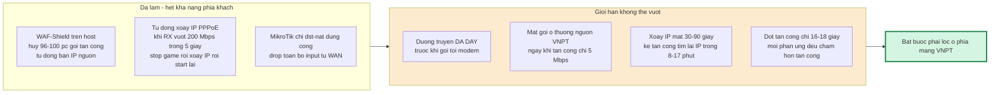

Số liệu cụ thể về giới hạn:

- **WAF hủy 96–100% gói tấn công** nhưng gói đã đi hết đường truyền trước khi tới host ⇒ người chơi vẫn rớt. WAF chỉ cứu được CPU và socket của game server.
- **Xoay IP tự động:** ngày 22–23/09 đã tự xoay **24 lần trong 12 giờ**, mỗi lần dịch vụ chết 18–133 giây. Tổng gián đoạn ~15 phút chỉ vì cơ chế phòng vệ, chưa kể thời gian người chơi kết nối lại.
- **Kẻ tấn công tìm lại IP mới trong 8–17 phút** và khoảng cách giữa các đợt đã rút từ 2,5 giờ xuống 8–17 phút ⇒ xoay IP đang thua cuộc đua.
- **Đợt tấn công chỉ 16–18 giây** (từ 23/09) — ngắn hơn cả thời gian hoàn tất một lần xoay IP.

---

## 7. Đề nghị cụ thể với VNPT

Xếp theo thứ tự ưu tiên và mức độ đơn giản khi triển khai.

### Ưu tiên 1 — Lọc thường trực trên UDP/7777 tới IP thuê bao

Đây là biện pháp giải quyết gần như toàn bộ khối lượng. Các luật xếp theo hiệu quả đo được trên dữ liệu thật; **riêng luật #1 đã xử lý 40/49 đợt (≈97% khối lượng gói)**.

| # | Tiêu chí lọc | Giá trị đề nghị | Cơ sở từ dữ liệu | Hợp lệ / Tấn công |
|---|---|---|---|---|
| **1** | **Rate-limit UDP → 7777 có độ dài IP > 512 B** | trần **400 pps** (vượt thì hủy) | Hợp lệ: TB 23,3 pps, **đỉnh 123 pps**. Tấn công vector A: **~20.000 pps** | **1 : 160** |
| 2 | Rate-limit UDP → 7777 theo **pps tổng** | trần **10.000 pps** | Hợp lệ p99 = 5.916, đỉnh 8.103 pps | 1 : 13 (đỉnh 132.871 pps) |
| 3 | Rate-limit UDP → 7777 theo **bps tổng** | trần **25 Mbps** | Hợp lệ ≤ 5 Mbps trên cổng 7777 | 1 : 90 (đỉnh 451 Mbps) |
| 4 | Rate-limit UDP → 7777 **theo từng IP nguồn** | trần **200 pps / IP** | Người chơi p99,9 = 96 pps; bot TB 507 pps, đỉnh **15.200 pps** | 1 : 158 |
| 5 | Hủy UDP → 7777 có **cổng nguồn 53, 123, 1900, 11211, 389, 19, 17, 3702, 5353** | hủy vô điều kiện | Reflection (§4.3). Game **không bao giờ** nhận gói từ các cổng này — 0 gói hợp lệ trong toàn bộ 38,2 triệu gói đã đo | tuyệt đối an toàn |

> 🔴 **KHÔNG làm:** hủy thẳng mọi gói > 512 B trên UDP/7777. Có **0,49% gói game hợp lệ** nằm trong khoảng 513–1500 B (xem §3.3) — hủy thẳng sẽ làm người chơi không vào được server. Phải dùng **rate-limit** như luật #1.
>
> Mọi ngưỡng trên áp **riêng cho UDP/7777**, không áp cho toàn thuê bao (lưu lượng hợp lệ chung có lúc đạt 413 Mbps do host tự tải file).

### Ưu tiên 2 — Anti-spoofing (uRPF / BCP38)

Bằng chứng ở §4.4: đã có **12.463 IP nguồn giả mạo mỗi giây** đi qua mạng tới thuê bao, gồm cả dải `100.64/10` (CGNAT, không thể là nguồn Internet) và `169.224/16`.

Đề nghị: bật uRPF ở biên, và chặn bogon / dải chưa cấp phát ở hướng vào.

### Ưu tiên 3 — Cảnh báo theo pps và theo số luồng, không chỉ theo bps

Hai vector nguy hiểm nhất (§4.2 và §4.3) đều **ở dưới ngưỡng băng thông thông thường**:

| Vector | Băng thông | pps | Số IP nguồn/giây |
|---|---|---|---|
| Flood gói nhỏ (17/09 01:06) | **57 Mbps** | **132.871** | 269 |
| DNS reflection (17/09 00:20) | **5,4 Mbps** | 2.086 | **709–930** |
| Spoof storm (17/09 18:50) | **6,1 Mbps** | 12.515 | **12.463** |

Đề nghị thêm tiêu chí phát hiện: **pps ≥ 20.000** hoặc **số IP nguồn mới ≥ 500/giây** tới một thuê bao ⇒ kích scrubbing.

### Ưu tiên 4 — Điều tra đoạn mất gói ở thượng nguồn

Đây là điểm cần VNPT trả lời (§4.3):

> Ngày 17/09 00:20:40 và 19/09 20:24:41, lưu lượng tới thuê bao **chỉ 5–6 Mbps** trên đường 300+ Mbps, thiết bị khách hủy 100% gói tấn công, **nhưng 54–69% gói của người chơi hợp lệ không tới được host** trong vòng 15–20 giây, và hồi phục ngay khi đợt tấn công kết thúc.
>
> Đề nghị kiểm tra: có policing/rate-limit theo **pps** hoặc theo **số session/luồng** trên BRAS hay trên đường PPPoE của thuê bao này không? Có cơ chế bảo vệ nào tự kích khi số luồng tăng vọt (700–900 IP nguồn mới mỗi giây) không? Số liệu counter drop phía BRAS ở đúng hai mốc thời gian trên sẽ xác nhận được.

### Ưu tiên 5 — Phối hợp vận hành

- **Cung cấp kênh báo sự cố nhanh** (hotline/API) để khách kích scrubbing thủ công khi cần.
- **Thông báo abuse tới nhà mạng nguồn**: LACNIC/NIC.br (42% bot), RIPE (25%). Danh sách IP đầy đủ ở Phụ lục A.
- **Cân nhắc IP tĩnh + scrubbing thường trực** thay cho cơ chế xoay IP hiện tại — xoay IP đang gây gián đoạn nhiều hơn là bảo vệ.

---

## Phụ lục A — Các file dữ liệu kèm theo

Tất cả trong thư mục [`du-lieu/`](du-lieu/), định dạng CSV (UTF-8, phân cách bằng dấu phẩy).

| File | Số dòng | Nội dung |
|---|---|---|
| [`01-cac-dot-tan-cong.csv`](du-lieu/01-cac-dot-tan-cong.csv) | 49 | Từng đợt tấn công: bắt đầu, kết thúc, thời lượng, đỉnh Mbps/pps/drops, số IP nguồn, loại |
| [`02-tong-hop-theo-ngay.csv`](du-lieu/02-tong-hop-theo-ngay.csv) | 6 | Tổng hợp theo ngày |
| [`03-ip-nguon-tan-cong.csv`](du-lieu/03-ip-nguon-tan-cong.csv) | 2.316 | IP nguồn có lưu lượng đo được: RIR, tổng gói, gói bị hủy, pps TB, TTL, lần đầu/cuối, đã bị chặn hay chưa |
| [`04-ip-da-bi-waf-chan.csv`](du-lieu/04-ip-da-bi-waf-chan.csv) | 6.985 | Toàn bộ IP WAF đã tự động chặn: số lần, lần đầu, lần cuối |
| [`05-ly-do-drop-theo-ngay.csv`](du-lieu/05-ly-do-drop-theo-ngay.csv) | 69 | Lý do hủy gói × ngày × số gói |
| [`06-cong-dich-theo-ngay.csv`](du-lieu/06-cong-dich-theo-ngay.csv) | 14.021 | Cổng đích × ngày × tổng gói × gói bị hủy (bằng chứng chỉ UDP/7777 bị tấn công) |

## Phụ lục B — Phương pháp và độ tin cậy

**Cách thu thập.** WAF-Shield chạy trên chính host game, dùng WinDivert 2.2 bắt **mọi gói IPv4 inbound** ở tầng kernel trước khi gói tới socket ứng dụng. Mỗi giây ghi một snapshot gồm: tổng pps/bps, số gói hủy theo từng lý do, histogram kích thước gói, histogram TTL, top cổng đích (kèm % đã xác thực hai chiều và số gói hủy), top cổng nguồn, top 20 IP nguồn (kèm pps, TTL, cổng nguồn/đích, 32 byte đầu payload dạng hex), top subnet /24.

**Cách xử lý.** 40 file `forensic.log` (1,4 GB) + 5 file `shield.log` được quét một lượt bằng `gawk`; các snapshot trùng nhau giữa các bộ log chồng lấp đã được loại; với những giây có nhiều snapshot, lấy giá trị lớn nhất. "Đợt tấn công" được định nghĩa là các giây liên tiếp (cho phép gián đoạn ≤ 60 giây) thỏa: **≥50 Mbps** và **≥1.000 gói bị hủy/giây**, hoặc — với vector băng thông thấp — **≥400 IP nguồn chưa xác thực/giây** kèm ≥500 gói hủy/giây hoặc ≥6.000 pps.

**Những gì đã loại khỏi thống kê để tránh báo cáo sai.** 5 đợt "giả" là host tự tải file: 18/09 21:24 (179 Mbps), 19/09 02:48 (114 Mbps), 19/09 12:57 (71 Mbps), 19/09 16:22 (57 Mbps), 23/09 14:19 (**413 Mbps**). Tất cả có **0 gói bị hủy, 100% đã xác thực hai chiều**, đích là cổng tạm 49152+ của host, nguồn là cổng 443 của Google/Cloudflare (QUIC/HTTP3) ⇒ không phải tấn công.

**Khoảng trống dữ liệu (nêu rõ để minh bạch).**

| Khoảng | Lý do |
|---|---|
| Trước 16/09 23:01 | Log forensic đã bị xoay vòng và ghi đè; số liệu 13–16/09 lấy từ hồ sơ vận hành và ảnh chụp |
| 19/09 23:32 → 21/09 12:46 | Không có log (WAF không chạy hoặc log không được giữ) |
| Toàn bộ ngày 21/09 trong forensic | Đã bị xoay mất; chỉ còn `shield.log` (6 đợt, 927 IP bị chặn) |

**Hai điểm cần lưu ý khi đọc số liệu.**

1. `uniq_ip` trong log chỉ đếm IP **chưa được xác thực hai chiều**, nên ở trạng thái bình thường thường bằng 0 — không phải lỗi.
2. Danh sách top IP nguồn chỉ ghi **20 IP nhiều nhất mỗi giây**, nên bảng `03-ip-nguon-tan-cong.csv` (2.316 IP) **nhỏ hơn thực tế**; con số đầy đủ hơn là danh sách 6.985 IP đã bị chặn (`04-...csv`) và tổng hợp 7.161 IP ở §5.1.

## Phụ lục C — Khai báo dịch vụ và cổng (gửi kèm form đăng ký AntiDDoS)

### C.1 Dải IP được bảo vệ

VNPT cấp **`14.253.193.8/29`** — block 8 địa chỉ, netmask `255.255.255.248`:

| | Địa chỉ |
|---|---|
| Địa chỉ mạng (không dùng được) | `14.253.193.8` |
| **Dùng được (6 IP)** | `14.253.193.9` → `14.253.193.14` |
| Broadcast (không dùng được) | `14.253.193.15` |

Đã kiểm chứng trên thiết bị thật (25/09): dải được **route về phiên PPPoE** của thuê bao (IP WAN vẫn động), `14.253.193.9` gán trên router trả lời ping từ ngoài, và route vẫn giữ sau khi phiên PPPoE quay lại — tức route bám theo tài khoản, không bám IP WAN.

> **IP chính thức chạy dịch vụ game: `14.253.193.10`** — đây là IP cần áp AntiDDoS. `14.253.193.12` dành làm IP quản trị (truy cập cổng giám sát). Các IP còn lại trong dải chưa sử dụng.

### C.2 Danh sách cổng và dịch vụ cần bảo vệ

```
--- Dịch vụ game (bắt buộc) ---
UDP 7777        The Isle: Evrima - cổng game chính (250 slot)
                *** ĐÂY LÀ CỔNG DUY NHẤT ĐANG BỊ TẤN CÔNG - 100% lưu lượng DDoS ***
UDP 7778        The Isle: Evrima - QueryPort (truy vấn thông tin server)
UDP 7779        The Isle: Evrima - dự phòng dải cổng game
TCP 7777-7779   The Isle: Evrima - dải cổng game (TCP)

--- Quản trị (bắt buộc) ---
TCP 8888        RCON - điều khiển/quản trị máy chủ game
TCP 10000       Hệ thống hàng đợi (queue) của máy chủ game

--- Dịch vụ phụ trợ ---
UDP 27015       Steam query - truy vấn danh sách server
UDP/TCP 64738   VoIP (Mumble) - thoại trong game
UDP/TCP 15000   Dịch vụ phụ trợ của máy chủ game

--- Lưu lượng hồi đáp (KHÔNG phải cổng dịch vụ, nhưng BẮT BUỘC cho qua) ---
TCP/UDP 49152-65535
                Cổng tạm của các kết nối do CHÍNH MÁY CHỦ mở ra Internet:
                phần mềm quản trị IslePilot (HTTPS qua Cloudflare), đăng nhập
                Steam/Epic EOS, cập nhật game. Chặn nhóm này = mất quyền quản
                trị máy chủ và người chơi không đăng nhập được.
```

Lưu lượng thật đo được trên từng cổng trong 9 ngày (đối chiếu với [`du-lieu/06-cong-dich-theo-ngay.csv`](du-lieu/06-cong-dich-theo-ngay.csv)):

| Cổng | Gói quan sát | Gói bị hủy | Tình trạng |
|---|---|---|---|
| UDP 7777 | 887.693.298 | **90.226.637** | Đang chạy — **toàn bộ tấn công ở đây** |
| TCP 8888 | 3.950.915 | 0 | Đang chạy (RCON) |
| TCP 10000 | 331.797 | 683 | Đang chạy (queue) |
| UDP 27015 | 12 | 0 | Có mở, gần như không dùng |
| UDP 64738 | 9 | 7 | Có mở, gần như không dùng |
| UDP 7778 / 7779 | 7 / 4 | 7 / 4 | Có mở, gần như không dùng |
| UDP 15000 | 1 | 1 | Có mở, gần như không dùng |

### C.3 Whitelist

```
1) 31.97.71.159  — VPS riêng của khách hàng, kết nối RCON vào TCP/8888.
                   Đây là nguồn DUY NHẤT hợp lệ kết nối vào cổng 8888
                   (xác nhận qua log: 20.240/20.248 gói).

2) Toàn bộ dải IPv4 công khai của Cloudflare, ÁP DỤNG CHO TCP:
   173.245.48.0/20   103.21.244.0/22   103.22.200.0/22   103.31.4.0/22
   141.101.64.0/18   108.162.192.0/18  190.93.240.0/20   188.114.96.0/20
   197.234.240.0/22  198.41.128.0/17   162.158.0.0/15    104.16.0.0/13
   104.24.0.0/14     172.64.0.0/13     131.0.72.0/22
   (nguồn: https://www.cloudflare.com/ips-v4)

   Lý do: phần mềm quản trị máy chủ game (IslePilot) chạy TRÊN host và kết nối
   RA NGOÀI qua Cloudflare. Nhà cung cấp KHÔNG công bố IP thật, nên bắt buộc
   phải tin cậy toàn bộ dải Cloudflare cho TCP.
```

### C.4 Yêu cầu bắt buộc khi áp dụng mitigation

```
1. Chỉ áp dụng lọc/rate-limit cho UDP cổng 7777. Đây là cổng duy nhất bị tấn
   công (100% lưu lượng tấn công, xác nhận qua log 9 ngày).

2. PHẢI giữ nguyên lưu lượng hồi đáp của các kết nối do máy chủ tự mở ra
   (inbound tới cổng tạm 49152-65535). Máy chủ chủ động kết nối ra Internet cho:
   phần mềm quản trị IslePilot (HTTPS qua Cloudflare), đăng nhập Steam/Epic EOS,
   cập nhật game. Chặn nhóm này là mất quyền quản trị máy chủ và người chơi
   không đăng nhập được.

3. KHÔNG lọc theo quốc gia / GeoIP. Người chơi đến từ khắp thế giới và phần mềm
   quản trị đặt tại châu Âu.

4. KHÔNG áp dụng chính sách "chỉ mở các cổng đã khai báo, chặn phần còn lại"
   cho chiều vào của thuê bao này.

5. Lưu lượng hợp lệ có thể lên tới 413 Mbps khi máy chủ cập nhật game (nguồn
   TCP/UDP 443, đích cổng tạm) — KHÔNG phải tấn công.
```

**Bối cảnh cho mục 2 và 3:** chính hai lỗi này đã từng xảy ra với tường lửa đặt tại host. Phần mềm quản trị IslePilot chạy trên máy chủ và chỉ kết nối **ra ngoài** qua Cloudflare, không có IP cố định để whitelist; khi tường lửa hủy nhầm gói hồi đáp (bắt cả IPv6 rồi hủy gói không phân tích được), IslePilot mất kết nối và báo "Unreachable / Network failure" — rất khó chẩn đoán vì không có thông báo lỗi tường lửa nào. Đề nghị VNPT lưu ý để không lặp lại ở tầng mạng.

### C.5 Kiểm tra sau khi bật mitigation

Đề nghị bật thử mitigation **10–15 phút lúc không bị tấn công**, kiểm tra theo thứ tự:

1. **Phần mềm quản trị IslePilot** còn báo trạng thái "Injected"/online không — đây là thứ hỏng đầu tiên nếu chặn nhầm.
2. **Người chơi quốc tế** còn vào được server không.
3. **RCON** từ `31.97.71.159` vào TCP/8888 còn kết nối được không.
4. Trên máy chủ: `Test-NetConnection islepilot.eu -Port 443` và `Get-NetTCPConnection -RemotePort 443` — nếu kết nối ra ngoài đứt thì đúng là lỗi ở mục C.4.2.

---

---

*Báo cáo sinh tự động từ log gốc. Mọi trích dẫn snapshot trong báo cáo là nguyên văn từ `forensic.log`, có thể đối chiếu lại bằng thời điểm ghi trong ngoặc vuông.*
